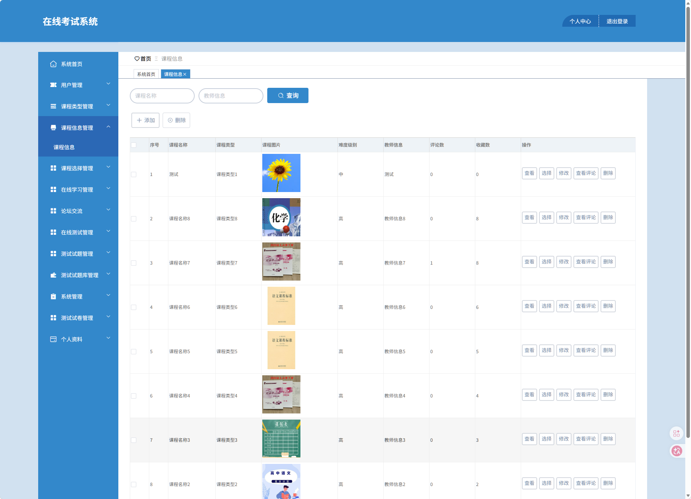
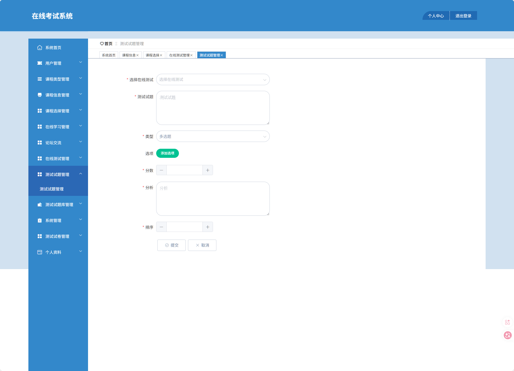
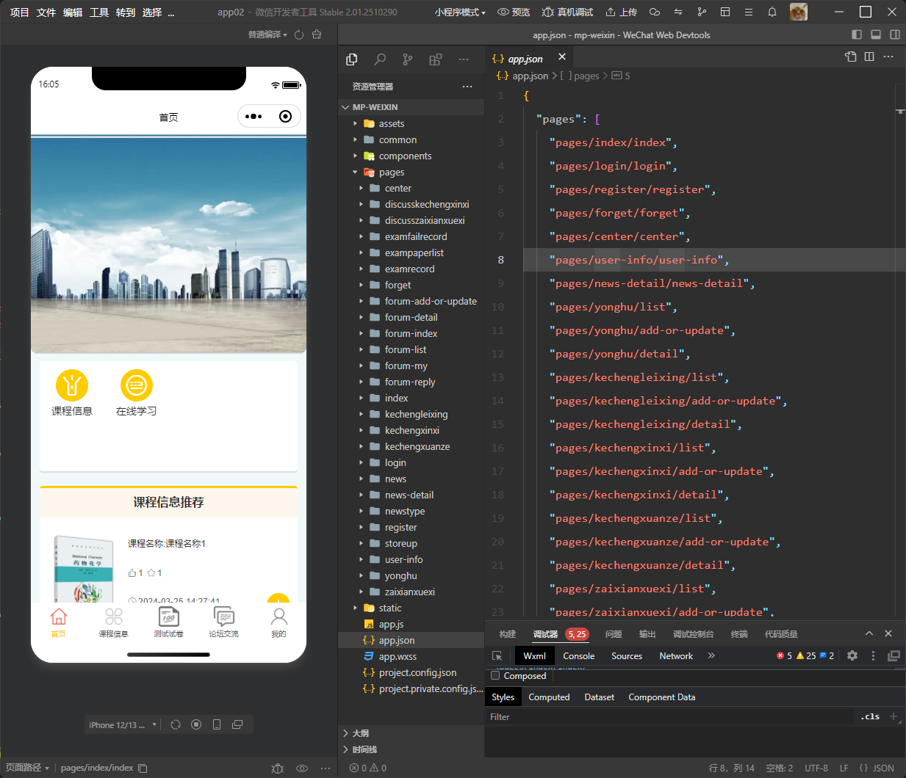
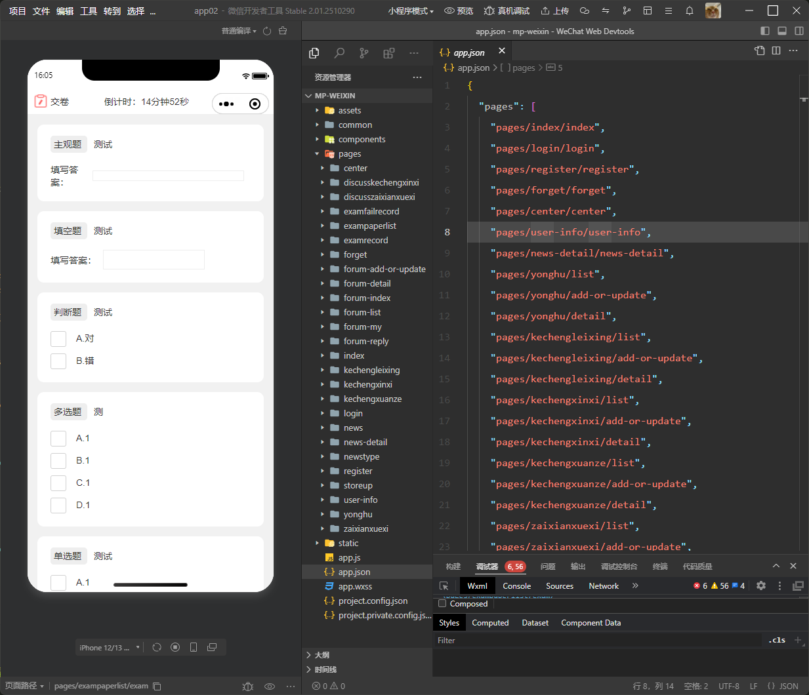
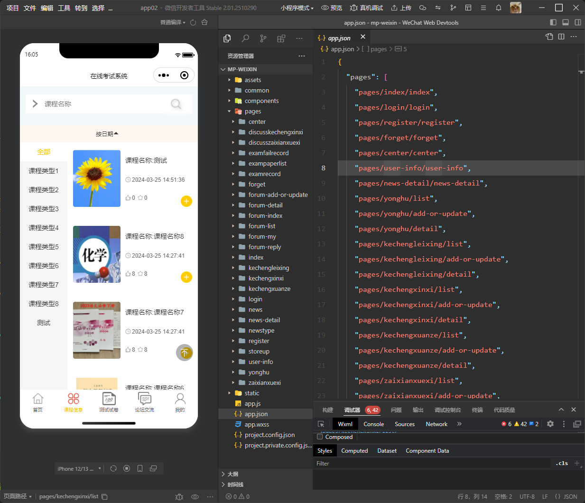

## 🌟 项目简介

这是一个基于 **Java + SpringBoot + uni-app + Vue + MySQL** 构建的完整考试报名系统，功能持续优化中...

uni-app：是一个使用 Vue.js 开发所有前端应用的框架，开发者编写一套代码，可发布到iOS、Android、鸿蒙Next、Web（响应式）、以及各种小程序（微信/支付宝/百度/抖音/飞书/QQ/快手/钉钉/淘宝/京东/小红书）、快应用、鸿蒙元服务等多个平台。

### 🧩 功能模块一览

- 用户登录 / 注册  
- 用户管理
- 课程类型管理
- 课程信息管理
- 课程选择管理
- 在线学习管理
- 论坛交流
- 在线测试管理
- 测试试题管理
- 测试试题库管理
- 系统管理
- 测试试卷管理
- 个人资料
- 其它...

### 🖼️ 界面预览

|  |  |  |
|--------------------------|--------------------------|--------------------------|
|  |  |  |

---

## ⚙️ 运行环境与工具要求

为了确保项目顺利运行，请确认您的开发环境满足以下条件：

### ✅ 推荐配置
- **Java**: JDK 1.8  
- **MySQL**: 8.0.41  
- **Node.js**: 16.20.2  

⚠️ *温馨提示：版本不一致可能导致依赖冲突或启动失败。*

### 🛠️ 开发工具推荐
- **后端开发**: IntelliJ IDEA 2022+  
- **前端开发**: VS Code、HBuilder X
- **数据库管理**: Navicat / DBeaver / MySQL Workbench  ...

---

## 📁 项目目录结构

解压后，您将看到以下核心目录：

```
📁 System/
├── JavaSpringBoot/       ← 后端源码（建议使用 IDEA 打开）
├── VueAdmin/             ← 管理员前端（建议使用 VS Code 打开）
├── UniappUser/           ← 用户端前端（需要使用 HBuilder X 打开）
└── MysqlDatabase/
    └── *.sql             ← 数据库脚本（建议使用 Navicat 导入）
```

📌 **重要提醒**：请将项目放置于 **纯英文路径** 下！  
❌ 错误示例：`D:\我的项目\app`  
✅ 正确示例：`D:\projects\my_app`

---

## 🚀 快速部署指南

按照以下步骤轻松完成项目部署：

### 1️⃣ 导入数据库
- 创建新数据库（例如 `my_project`），字符集设置为 `utf8mb4`
- 执行 `MysqlDatabase/*.sql` 脚本完成数据初始化

### 2️⃣ 启动后端服务
- 使用 **IntelliJ IDEA** 打开 `JavaSpringBoot` 目录
- 等待 Maven 自动下载依赖项（首次加载时间较长）
- 修改 `application.yml` 文件中的数据库连接参数
- 运行主启动类，控制台显示 `"Tomcat started on port(s): 8080"` 即表示成功

### 3️⃣ 启动管理员前端 (VueAdmin)
进入 `VueAdmin` 目录，依次执行以下命令：
```bash
npm install     # 安装依赖（仅首次运行需要）
npm run serve   # 启动本地服务器
```
🔗 启动完成后，访问输出地址（如 `http://localhost:8081`）即可查看效果。

### 4️⃣ 启动用户端前端 (UniappUser)
进入 `UniappUser` 目录，执行以下步骤：
```bash
npm install     # 安装依赖（仅首次运行需要）
```
- 使用 **HBuilder X** 打开 `UniappUser` 目录
- 在 HBuilder X 中点击左上角的 **“运行”** 按钮
- 选择 **“运行到浏览器”**、**“运行到小程序模拟器”** 或 **“运行到手机/模拟器”** 任意平台
- ⚡ **提示**：首次运行时，IDE 会自动下载并安装所需的编译器及插件，请耐心等待完成即可。

---


## ⚡ 加速技巧 & 常见问题解答

### 🔄 国内镜像加速配置

#### NPM 镜像（永久生效）
```bash
npm config set registry https://registry.npmmirror.com
```

#### Maven 镜像（修改 `~/.m2/settings.xml`）
```xml
<mirror>
  <id>aliyun</id>
  <mirrorOf>*</mirrorOf>
  <name>阿里云仓库</name>
  <url>https://maven.aliyun.com/repository/public</url>
</mirror>
```

### 🚫 端口冲突解决方案
若遇到端口被占用的情况，请尝试：
- 修改后端 `application.yml` 中的 `server.port`
- 或调整前端 `vue.config.js` 的 `devServer.port`

---

## 📲 获取更多帮助

### 🔍 联系我们
关注公众号【斯内普的数字坩埚】，回复关键词 **部署** 即可获取：
- 最新版部署文档  
- 其它的代码项目程序  
- 镜像配置详细教程  
- 微信/QQ 联系方式  

📷 扫码关注👇  


---

## 💬 技术支持与服务

### 🆓 免费支持政策
- 提供完整的部署文档及常见问题解答  
- 若仍有疑问，请附上 **代码截图**，我们将尽快为您排忧解难！

---

## ⚖️ 法律声明

本项目基于 GitHub 开源项目进行二次开发，仅供 **个人学习与技术交流** 使用。  
- 原项目版权归其作者所有  
- ❌ 禁止用于商业用途、转售或冒充原创作品  
- 商业使用请联系原作者获得授权  

---

© 2026 斯内普的部署指南 · 让部署更简单✨

